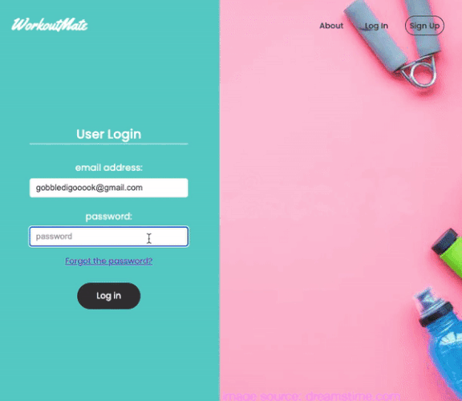

<h1 align="center"><a href="https://workout-mate.onrender.com/">Workout Mate</a></h1>
 

 
 

 <i>
Workout Mate is there for you when you need to keep track of your physical activity. 
It lets you submit exercise whenever you want and without any real-life relavance if that's what you prefer.
Workout Mate doesn't judge.
Workout Mate lets you be the athlete you want to be.</i>

 

---

## Table of Contents

1. [How did it come about?](#motivation)
2. [App Features](#features)
3. [Tools and Dependencies](#tools)
4. [Test coverage](#test)
5. [Todos](#todos)
6. [Resources](#resources)
7. [Author](#author)

---
 

## How did it come about? 

 
Workout Mate started off as a basic made-from-scratch CRUD project that I decided to build on top of to create a more complete web app.

 

## App Features (User's perspective walkthrough)

 
As a user, you can create an account on Workout Mate from the Signup page with a valid email address and a strong password. You will then be sent an email with a link to confirm your account. Clicking on the link, you will be redirected to the page that will inform you that your account has been confirmed successfully and you can go to the Login page and use your credentials to access your account. If you enter wrong credentials, you will be alerted so. 
 
Once you log in successfully, you will be redirected to your Home page where you will see your generated default username and avatar in the Navbar section. These can be changed by clicking on the avatar or username and then clicking the "Settings" option. This will open the "Profile Settings" form (modal) where you can enter a different username and choose a custom profile image from your device that you can also crop to your taste within the form. All the changes that you made will be saved after clicking the "Upload" button. You can close the modal by clicking the "X" in the top right corner of the form.
 
You can start adding workouts by clicking the "Buff It Up" button. The workout form will appear with "title", "muscle group", "reps" and "load" input fields that you'll have to fill with valid values. Clicking "Add Workout" with valid input will close the modal and make a card with your workout details appear on the page. The time of the entry will be added automatically on every card and you'll find that the workouts are sorted in the chronological order, newer first.
 
As you keep adding workouts, you'll make use of the Pagination feature at the bottom-left of the page that will enable you to access your entire workout history by clicking on butons with page numbers or chevrons, since the limit is set to 3 workouts per page. Also, you can use the Search bar in the top-left section of the page (right below the Navbar) to search your workout history by the workout title.
 
Every workout card contains a "delete workout" (trash can) and "edit workout" (pen) icons at the bottom right of the card. By clicking on the trash can, the workout will be deleted from the database. By clicking on the pen, the Edit workout form will pop up and it will be pre-filled with the current workout details. After editing the workout and clicking save, the workout will be updated with the new details. You can opt out of editing by clicking "X".
 
You can finish your session with Workout Mate by clicking Log Out in the dropdown menu of your avatar/username and you will be logged out and redirected to the Login page.
 
If you happen to forget your password, you will be able to recover it by first clicking on "Forgot the password?" that's in the login form, which will open a "Reset password request" form that will ask you to enter your email address that you have an account with. Once you correctly enter your email address and click "Proceed", you will be alerted to check your inbox for an email with the password reset link. When you click on the password reset link, you will be redirected to the password reset page that will contain a single form asking you to type your new password in two input fields. The form will check the strength of the new password as well as whether the passwords are matching before you will be allowed to finish the password reset. Once you've successfully reset your password, you will be able to access your account with it.
 
In case you want to delete your Workout Mate account, you will have to log in, open "Profile Settings" from the dropdown menu and click on "delete account" at the bottom-right of the form. You will see a dialogue pop-up that will warn you about the consequences of deleting your account and will give you an option to change your mind or delete your account permanently. After you click on "Yes, delete my account permanently", all your data will be deleted from the database and you will be redirected to the Login page.
 
 <b>NOTE:</b> The limits to the number of registered users and workouts per user have been set. If these limits are reached at any point, the app will start deleting the oldest registered user/workout from the database with each new entry.

 

## Tools and Dependencies 

### Backend

- [NodeJS](https://nodejs.org/en/) - Server logic
- [Express](https://expressjs.com/) - Routing
- [MongoDB](https://account.mongodb.com/account/login) - Database
- [Mongoose](https://mongoosejs.com/) - MongoDB document modelling
- [Bcrypt](https://www.npmjs.com/package/bcrypt) - hashing passwords
- [Dotenv](https://www.npmjs.com/package/dotenv) - secret-keeping
- [Cors](https://github.com/expressjs/cors) - enabling CORS requests
- [JWT](https://jwt.io/) - Authentication
- [Validator](https://www.npmjs.com/package/validator) - request (input) validation
- [Nodemailer](https://nodemailer.com/about/) - Email sending middleware
- [Handlebars](https://handlebarsjs.com/) - Email templates
- [Ethereal email](https://ethereal.email/) - Mock SMTP service
- [Express rate limit](https://github.com/express-rate-limit/express-rate-limit) - Request rate limiting

#### Dev Dependencies

- [Jest](https://jestjs.io/) - Javascript testing framework
- [Supertest](https://github.com/ladjs/supertest) - testing HTTP requests
- [MongoDB Memory Server](https://github.com/nodkz/mongodb-memory-server) - testing/mocking MongoDB memory server in NodeJS
- [@shelf/jest-mongodb](https://www.npmjs.com/package/@shelf/jest-mongodb) - A Jest preset for running MongoDB memory server

### Frontend

- [React](https://reactjs.org/) - User interface
- [React router](https://reactrouter.com/en/main) - Browser routing
- [Redux](https://redux.js.org/) - State management
- [React easy crop](https://www.npmjs.com/package/react-easy-crop) - Image cropping
- [Date-fns](https://date-fns.org/) - Date formatting
- [ChartJS](https://www.chartjs.org/) - Charting library
- [React ChartJS](https://react-chartjs-2.js.org/) - ChartJS library for React
- [SASS](https://sass-lang.com/) - Styling

 

## Test coverage             
  Coming soon.
 

## Todos 
 - Capacity management mechanism should involve automated deletion of accounts after a period of inactivity.
 - Users should be adequatly informed about the capacity management mechanism.
 - Users should have an option to commit to using their account and posting workouts to avoid automated deletion.
 

## Resources 

You can start building the app from scratch by following along [this tutorial](https://www.youtube.com/watch?v=98BzS5Oz5E4&list=PL4cUxeGkcC9iJ_KkrkBZWZRHVwnzLIoUE) (beginner-friendly).

 

## Author 

[@marija-kov](https://github.com/Marija-Kov) 

 
